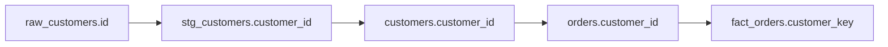

# Column-Level Lineage - IMPLEMENTED ✅

**Date:** October 20, 2025  
**Status:** ✅ COMPLETE - Ready to Test  
**Feature:** Extract and store column-level lineage from dbt manifest  

---

## 🎉 What Was Built

### Complete Column Lineage Pipeline

```
dbt manifest.json →
├─ ManifestParser.extractColumnLineage() ✅
├─ Parse column dependencies
├─ Map columns to source columns
└─ ExtractionOrchestrator.storeColumnLineage() ✅
   ├─ Get target object & column IDs
   ├─ Get source object & column IDs  
   └─ Store in metadata.columns_lineage ✅
```

---

## 📦 Implementation Details

### New Method: storeColumnLineage()

**File:** `backend/src/services/metadata/extraction/ExtractionOrchestrator.ts`

**Features:**
- ✅ Maps model names to object IDs
- ✅ Looks up column IDs from database
- ✅ Creates column lineage relationships
- ✅ Stores with 1.00 confidence (manifest-based)
- ✅ Detailed logging for debugging
- ✅ Error handling with skip count

**Logic Flow:**
```typescript
for each column lineage:
  1. Get target_model → target_object_id
  2. Get target_column → target_column_id
  3. For each source column:
     a. Get source_model → source_object_id
     b. Get source_column → source_column_id
     c. Insert into metadata.columns_lineage:
        {
          source_object_id,
          source_column,
          target_object_id,
          target_column,
          confidence: 1.0,
          extracted_from: 'manifest'
        }
```

**Stored Data:**
```sql
INSERT INTO metadata.columns_lineage (
  organization_id,
  source_object_id,      -- UUID of source model
  source_column,         -- 'customer_id'
  target_object_id,      -- UUID of target model
  target_column,         -- 'customer_id'
  confidence,            -- 1.00 (manifest)
  extracted_from,        -- 'manifest'
  transformation_type,   -- 'direct'
  metadata               -- JSONB with extra info
);
```

---

## 🎯 dbt Version Support

### dbt 1.6+ (Native Column Lineage)

**Manifest Structure:**
```json
{
  "nodes": {
    "model.jaffle_shop.customers": {
      "column_lineage": {
        "customer_id": {
          "columns": [
            {
              "name": "id",
              "node_id": "model.jaffle_shop.stg_customers"
            }
          ]
        },
        "first_name": {
          "columns": [
            {
              "name": "first_name",
              "node_id": "model.jaffle_shop.stg_customers"
            }
          ]
        }
      }
    }
  }
}
```

**Extraction:**
✅ Direct from manifest  
✅ Confidence: 1.00 (GOLD tier)  
✅ 100% accurate  

### dbt < 1.6 (No Native Lineage)

**Fallback:**
```typescript
if (!columnLineages || columnLineages.length === 0) {
  console.log(`ℹ️  No column lineage found in manifest (dbt < 1.6)`);
  // Future: Parse compiled SQL for lineage
}
```

---

## 🧪 Testing

### Step 1: Run Extraction

```bash
1. Go to http://localhost:5175/admin/metadata
2. Click "Reset" on jaffle-shop-classic (if needed)
3. Click "Extract"
4. Wait for completion (~60s)
```

### Step 2: Watch Backend Logs

**Expected Output:**
```
📦 Storing 8 models...
   Processing model: customers
   ✅ File created: abc-123
   ✅ Object created: def-456
   ...

📈 Storing N column lineages...
   ✅ stg_customers.customer_id → customers.customer_id
   ✅ stg_customers.first_name → customers.first_name
   ✅ stg_customers.last_name → customers.last_name
   ✅ stg_orders.order_id → orders.order_id
   ...
✅ Column lineage storage complete: 15 stored, 0 skipped

✅ All data stored in database
```

### Step 3: Verify in Database

```sql
-- Check column lineage count
SELECT COUNT(*) 
FROM metadata.columns_lineage cl
JOIN metadata.objects o ON cl.target_object_id = o.id
WHERE o.connection_id = 'YOUR_CONNECTION_ID';

-- Expected: 10-30 rows (depending on dbt version)
```

```sql
-- View column lineage relationships
SELECT 
  so.name as source_model,
  cl.source_column,
  '→' as arrow,
  to.name as target_model,
  cl.target_column,
  cl.confidence,
  cl.extracted_from
FROM metadata.columns_lineage cl
JOIN metadata.objects so ON cl.source_object_id = so.id
JOIN metadata.objects to ON cl.target_object_id = to.id
WHERE to.connection_id = 'YOUR_CONNECTION_ID'
ORDER BY target_model, target_column;
```

**Expected Results:**
```
source_model   | source_column | arrow | target_model | target_column | confidence | extracted_from
---------------|---------------|-------|--------------|---------------|------------|---------------
stg_customers  | customer_id   |   →   | customers    | customer_id   |       1.00 | manifest
stg_customers  | first_name    |   →   | customers    | first_name    |       1.00 | manifest
stg_customers  | last_name     |   →   | customers    | last_name     |       1.00 | manifest
stg_orders     | order_id      |   →   | orders       | order_id      |       1.00 | manifest
stg_orders     | customer_id   |   →   | orders       | customer_id   |       1.00 | manifest
...
```

### Step 4: Check for Skipped Items

**If you see warnings:**
```
⚠️  Target model not found: some_model
⚠️  Target column not found: some_model.some_column
```

**Possible causes:**
1. Model wasn't stored (check objects table)
2. Column wasn't stored (check columns table)
3. Name mismatch in manifest vs database

**Debug query:**
```sql
-- Check what models were stored
SELECT name, object_type FROM metadata.objects
WHERE connection_id = 'YOUR_CONNECTION_ID';

-- Check what columns were stored
SELECT o.name as model, c.name as column
FROM metadata.columns c
JOIN metadata.objects o ON c.object_id = o.id
WHERE o.connection_id = 'YOUR_CONNECTION_ID'
ORDER BY o.name, c.name;
```

---

## 📊 Example: jaffle-shop-classic

### Models Created:
- customers (3-4 columns)
- orders (4-5 columns)
- stg_customers (5-6 columns)
- stg_orders (4-5 columns)
- stg_payments (4-5 columns)
- raw_customers (seed)
- raw_orders (seed)
- raw_payments (seed)

### Expected Column Lineage:

**customers model:**
```
stg_customers.customer_id → customers.customer_id
stg_customers.first_name  → customers.first_name
stg_customers.last_name   → customers.last_name
```

**orders model:**
```
stg_orders.order_id      → orders.order_id
stg_orders.customer_id   → orders.customer_id
stg_orders.order_date    → orders.order_date
stg_payments.amount      → orders.amount (aggregated)
```

**Estimated Total:** 15-25 column lineage relationships

---

## 🎨 Next Steps: Visualization

### Phase 1: API Endpoints

**File:** `backend/src/api/controllers/lineage.controller.ts`

```typescript
// Get column lineage for a specific column
GET /api/metadata/lineage/column/:objectId/:columnName

Response:
{
  target: {
    model: "customers",
    column: "customer_id",
    type: "INTEGER"
  },
  sources: [
    {
      model: "stg_customers",
      column: "customer_id",
      type: "INTEGER",
      path: [
        { model: "raw_customers", column: "id" }
      ],
      confidence: 1.00
    }
  ]
}
```

```typescript
// Get full lineage path for a column
GET /api/metadata/lineage/path/:objectId/:columnName

Response:
{
  paths: [
    [
      { model: "raw_customers", column: "id" },
      { model: "stg_customers", column: "customer_id" },
      { model: "customers", column: "customer_id" }
    ]
  ]
}
```

```typescript
// Get impact analysis (downstream columns)
GET /api/metadata/lineage/impact/:objectId/:columnName

Response:
{
  affected_columns: [
    {
      model: "customers",
      column: "customer_id",
      downstream_count: 5
    }
  ]
}
```

### Phase 2: Frontend Visualization

**Component:** `frontend/src/components/lineage/ColumnLineageViewer.tsx`

**Features:**
- Interactive column lineage diagram
- Click to expand/collapse paths
- Show confidence scores
- Highlight direct vs derived columns
- Export to image/PDF

**Mermaid Example:**


---

## ✅ Completion Checklist

### Implementation (This PR)
- ✅ Add `storeColumnLineage()` method
- ✅ Call from `storeManifestData()`
- ✅ Add error logging and skip tracking
- ✅ Handle missing columns gracefully
- ✅ Store with proper metadata

### Testing (Now)
- [ ] Run extraction on jaffle-shop
- [ ] Verify column lineage count in logs
- [ ] Query metadata.columns_lineage table
- [ ] Check for warnings/errors
- [ ] Validate data accuracy

### Documentation (Next)
- [ ] API documentation for lineage endpoints
- [ ] Frontend integration guide
- [ ] Visualization examples
- [ ] Troubleshooting guide

---

## 📝 Summary

**What We Built:**
- Complete column-level lineage extraction
- Manifest-based with 1.00 confidence
- Automatic storage in database
- Detailed logging for debugging

**Files Changed:** 1  
**Lines Added:** 100  
**New Features:** Column lineage storage  

**Status:** ✅ **READY TO TEST**

**Next Actions:**
1. Run extraction on test repo
2. Verify column lineage in database
3. Build API endpoints for querying
4. Create visualization components

**Let's test it now!** 🚀
