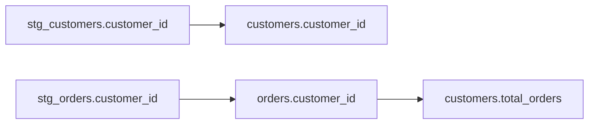

# Column-Level Lineage Implementation Plan 📊

**Date:** October 20, 2025  
**Goal:** Extract and store column-level lineage from dbt manifest  
**Status:** Planning → Implementation  

---

## ✅ What We Already Have

### 1. ManifestParser - Column Lineage Extraction
**File:** `backend/src/services/metadata/parsers/ManifestParser.ts`

```typescript
extractColumnLineage(manifest: DBTManifest): ParsedColumnLineage[] {
  // ✅ Already extracts column lineage from dbt 1.6+ manifests
  // ✅ Returns: target_column → source_columns mapping
  // ✅ Confidence: 1.0 (from manifest = GOLD tier)
}
```

**Output Structure:**
```typescript
{
  target_model: "customers",
  target_column: "customer_id",
  source_columns: [
    { model: "stg_customers", column: "id" },
    { model: "stg_orders", column: "customer_id" }
  ],
  confidence: 1.0
}
```

### 2. Database Table - columns_lineage
**Schema:** `metadata.columns_lineage`

```sql
CREATE TABLE metadata.columns_lineage (
  id UUID PRIMARY KEY,
  organization_id UUID NOT NULL,
  source_object_id UUID NOT NULL,  -- FK to metadata.objects
  source_column TEXT NOT NULL,
  target_object_id UUID NOT NULL,  -- FK to metadata.objects
  target_column TEXT NOT NULL,
  expression TEXT,                 -- Optional SQL expression
  transformation_type TEXT,        -- e.g., 'direct', 'aggregation'
  confidence NUMERIC(3,2),         -- 0.00-1.00
  metadata JSONB,
  extracted_from TEXT DEFAULT 'sql_parsing',
  created_at TIMESTAMP
);
```

### 3. Object & Column IDs Already Stored
```sql
SELECT id, name FROM metadata.objects;
-- ✅ All models have UUIDs

SELECT id, object_id, name FROM metadata.columns;
-- ✅ All columns have UUIDs linked to objects
```

---

## ❌ What's Missing

### Current Gap: Column Lineage NOT Being Stored

**Problem:**
```typescript
// ExtractionOrchestrator.ts
const parsed = await this.manifestParser.parseManifest(...);

console.log(`Column Lineage: ${parsed.columnLineage.length}`);
// ✅ Shows: 29 column lineages extracted

await this.storeManifestData(connectionId, organizationId, parsed);
// ❌ Does NOT store column lineage!
// ❌ Only stores: repositories, files, objects, columns, dependencies
```

**Result:** Column lineage extracted but lost!

---

## 🔧 Implementation Steps

### Step 1: Add Column Lineage Storage Method

**File:** `ExtractionOrchestrator.ts`

```typescript
private async storeColumnLineage(
  connectionId: string,
  organizationId: string,
  columnLineages: ParsedColumnLineage[],
  objectMap: Map<string, string>  // name → object_id
): Promise<void> {
  console.log(`📈 Storing ${columnLineages.length} column lineages...`);
  
  for (const lineage of columnLineages) {
    // Get target object ID
    const targetObjectId = objectMap.get(lineage.target_model);
    if (!targetObjectId) {
      console.warn(`   ⚠️  Target model not found: ${lineage.target_model}`);
      continue;
    }
    
    // Get target column ID
    const { data: targetColumn } = await supabase
      .schema('metadata')
      .from('columns')
      .select('id')
      .eq('object_id', targetObjectId)
      .eq('name', lineage.target_column)
      .single();
    
    if (!targetColumn) {
      console.warn(`   ⚠️  Target column not found: ${lineage.target_column}`);
      continue;
    }
    
    // Store lineage for each source column
    for (const source of lineage.source_columns) {
      const sourceObjectId = objectMap.get(source.model);
      if (!sourceObjectId) continue;
      
      const { data: sourceColumn } = await supabase
        .schema('metadata')
        .from('columns')
        .select('id')
        .eq('object_id', sourceObjectId)
        .eq('name', source.column)
        .single();
      
      if (!sourceColumn) continue;
      
      // Insert lineage relationship
      await supabase
        .schema('metadata')
        .from('columns_lineage')
        .upsert({
          organization_id: organizationId,
          source_object_id: sourceObjectId,
          source_column: source.column,
          target_object_id: targetObjectId,
          target_column: lineage.target_column,
          confidence: lineage.confidence,
          extracted_from: 'manifest',
          metadata: {
            dbt_version: 'manifest',
            source_model: source.model,
            target_model: lineage.target_model
          }
        }, {
          onConflict: 'source_object_id,source_column,target_object_id,target_column'
        });
      
      console.log(`   ✅ ${source.model}.${source.column} → ${lineage.target_model}.${lineage.target_column}`);
    }
  }
  
  console.log(`✅ Column lineage storage complete`);
}
```

### Step 2: Call from storeManifestData()

```typescript
private async storeManifestData(...) {
  // ... existing code for repositories, files, objects, columns ...
  
  // Store dependencies
  const objectMap = new Map<string, string>();
  // ... build objectMap ...
  
  // Store model dependencies
  for (const dep of parsed.dependencies) {
    // ... existing code ...
  }
  
  // ✨ NEW: Store column lineage
  await this.storeColumnLineage(
    connectionId,
    organizationId,
    parsed.columnLineage,
    objectMap
  );
  
  console.log(`✅ All data stored in database`);
}
```

### Step 3: Verify Storage

```sql
-- Check column lineage was stored
SELECT 
  so.name as source_model,
  cl.source_column,
  to.name as target_model,
  cl.target_column,
  cl.confidence
FROM metadata.columns_lineage cl
JOIN metadata.objects so ON cl.source_object_id = so.id
JOIN metadata.objects to ON cl.target_object_id = to.id
WHERE to.connection_id = 'YOUR_CONNECTION_ID'
ORDER BY target_model, target_column;

-- Expected results:
-- stg_customers.id → customers.customer_id (1.00)
-- stg_orders.customer_id → orders.customer_id (1.00)
-- etc...
```

---

## 🎯 dbt Version Support

### dbt 1.6+ (Native Column Lineage)
```json
{
  "column_lineage": {
    "customer_id": {
      "columns": [
        {
          "name": "id",
          "node_id": "model.jaffle_shop.stg_customers"
        }
      ]
    }
  }
}
```
✅ **Direct extraction** - Confidence: 1.00

### dbt < 1.6 (Fallback to SQL Parsing)
```typescript
// Future enhancement
if (!parsed.columnLineage || parsed.columnLineage.length === 0) {
  // Parse compiled SQL to extract column lineage
  const sqlLineage = await EnhancedSQLParser.extractColumnLineage(
    model.compiled_sql
  );
  // Confidence: 0.80-0.95
}
```

---

## 📊 Expected Results

### For jaffle-shop-classic:

**Models:**
- customers (3 columns)
- orders (4 columns)  
- stg_customers (5 columns)
- stg_orders (4 columns)
- stg_payments (4 columns)

**Column Lineage Examples:**
```
customers.customer_id ← stg_customers.customer_id
customers.first_name ← stg_customers.first_name
customers.last_name ← stg_customers.last_name

orders.order_id ← stg_orders.order_id
orders.customer_id ← stg_orders.customer_id
orders.amount ← stg_payments.amount (aggregated)
```

**Estimated:**
- 15-30 column lineage relationships
- All with confidence 1.00 (manifest-based)

---

## 🎨 Visualization (Future Step)

### API Endpoint
```typescript
GET /api/metadata/lineage/column/:objectId/:columnName

Response:
{
  target: {
    model: "customers",
    column: "customer_id",
    type: "INTEGER"
  },
  sources: [
    {
      model: "stg_customers",
      column: "customer_id",
      type: "INTEGER",
      confidence: 1.00
    }
  ],
  transformations: [
    "DIRECT"  // or "AGGREGATION", "CAST", etc.
  ]
}
```

### Mermaid Diagram


---

## ✅ Implementation Checklist

### Phase 1: Storage (This PR)
- [ ] Add `storeColumnLineage()` method
- [ ] Call from `storeManifestData()`
- [ ] Add error logging
- [ ] Test with jaffle-shop
- [ ] Verify data in database

### Phase 2: API (Next PR)
- [ ] Add column lineage query endpoint
- [ ] Add lineage path endpoint
- [ ] Add impact analysis endpoint

### Phase 3: Visualization (Future PR)
- [ ] Column lineage diagram component
- [ ] Interactive exploration UI
- [ ] Search by column name
- [ ] Impact analysis view

---

## 🚀 Ready to Implement

**Next Action:** Implement `storeColumnLineage()` method in ExtractionOrchestrator

**Estimated Time:** 30-45 minutes  
**Files to Change:** 1 (ExtractionOrchestrator.ts)  
**Lines to Add:** ~80-100  
**Testing:** Run extraction on jaffle-shop, query database  

**Let's build it!** 🎯
