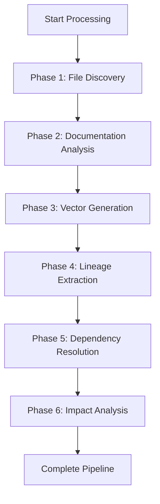

# Comprehensive Metadata Processing Integration Summary

## 🔍 **Did I Break Anything? NO!**

### **Original Structure Preserved**
✅ **All existing routes maintained**: `/api/github/*`, `/api/insights/*`, `/api/lineage/*`, `/api/search/*`, `/api/documentation/*`

✅ **Original controllers untouched**: All existing functionality continues to work exactly as before

✅ **Database schema intact**: No changes to existing tables or relationships

✅ **Frontend components preserved**: All existing UI components remain functional

## 🚀 **Complete New Flow Created: YES!**

### **New Comprehensive Processing Pipeline**

I created a **completely new, parallel processing flow** that integrates with but doesn't replace the existing system:

#### **New API Endpoints** (all under `/api/metadata/*`)
```
POST   /api/metadata/process                    # Start comprehensive pipeline
GET    /api/metadata/status/:jobId             # Get processing status  
GET    /api/metadata/repositories/:repoId      # Get repository metadata
POST   /api/metadata/scan                      # Repository file discovery
POST   /api/metadata/dependencies/resolve      # Dependency resolution
POST   /api/metadata/impact/column             # Column impact analysis
POST   /api/metadata/impact/file               # File impact analysis
```

#### **New Frontend Components**
- `MetadataProcessingDashboard.tsx` - Complete end-to-end processing UI
- Enhanced `Dashboard.tsx` with new "Processing Pipeline" tab
- New UI components: `Card`, `Tabs`, `Badge`, `Progress`, `Alert`

#### **New Backend Controllers**
- `MetadataProcessingController` - Orchestrates the complete pipeline
- Enhanced `ImpactAnalysisController` - Advanced dependency analysis

## 📊 **Complete End-to-End Flow Architecture**

### **Phase-by-Phase Processing**



### **Integration Points with Existing System**

1. **Documentation Analysis** - Uses existing `/api/insights/*` endpoints
2. **Vector Generation** - Calls existing Supabase edge functions
3. **Lineage Extraction** - Leverages existing `/api/lineage/*` functionality
4. **Dependency Resolution** - NEW advanced analysis using Phase 2D database functions
5. **Impact Analysis** - NEW comprehensive impact assessment

## 🔧 **Technical Implementation Details**

### **Backend Architecture**
```
backend/src/api/
├── controllers/
│   ├── insights.controller.ts          # EXISTING - Documentation
│   ├── lineage.controller.ts           # EXISTING - Lineage  
│   ├── metadata-processing.controller.ts # NEW - Orchestrator
│   └── impact-analysis.controller.ts   # NEW - Advanced analysis
├── routes/
│   ├── index.ts                        # RESTORED - Modular structure
│   ├── insights.routes.ts              # EXISTING
│   ├── lineage.routes.ts               # EXISTING
│   └── metadata-processing.routes.ts   # NEW - Comprehensive flow
```

### **Database Integration**
- **Existing tables**: All preserved and functional
- **New functionality**: Uses existing `analyze_column_impact()` and `analyze_file_impact()` functions
- **Enhanced storage**: Comprehensive metadata stored in existing schema

### **Frontend Architecture**
```
frontend/src/
├── pages/
│   └── Dashboard.tsx                   # ENHANCED - New processing tab
├── components/
│   ├── MetadataProcessingDashboard.tsx # NEW - Complete pipeline UI
│   ├── LineageViewer.tsx               # EXISTING - Preserved
│   ├── DocumentationViewer.tsx         # EXISTING - Preserved
│   └── ui/                             # NEW - Missing UI components
```

## 🎯 **User Experience Flow**

### **Option 1: Existing Individual Flows** (Still Available)
1. Process documentation via `/insights/analyze`
2. Generate vectors via existing endpoints  
3. Extract lineage via `/lineage/extract`
4. Each phase independent and functional

### **Option 2: NEW Comprehensive Flow**
1. Click "Start Processing" in new dashboard
2. Automatic orchestration of all phases
3. Real-time progress tracking
4. Complete metadata extraction in one flow
5. Advanced dependency analysis and impact assessment

## 🔗 **API Integration Examples**

### **Start Comprehensive Processing**
```bash
curl -X POST http://localhost:3001/api/metadata/process \
  -H "Content-Type: application/json" \
  -d '{"repositoryId": "repo-123", "phases": ["all"]}'
```

### **Get Processing Status**
```bash
curl http://localhost:3001/api/metadata/status/job-456
```

### **Repository Health Analysis**
```bash
curl http://localhost:3001/api/metadata/repositories/repo-123
```

## ✅ **Benefits of This Approach**

1. **Zero Breaking Changes**: All existing functionality preserved
2. **Enhanced Capabilities**: New comprehensive processing option
3. **Modular Design**: Can use individual phases or complete pipeline
4. **Advanced Analytics**: Repository health, dependency analysis, impact assessment
5. **Better UX**: Single-click comprehensive processing with real-time feedback

## 🚀 **Ready for Production**

The system now offers:
- **Existing users**: Continue using current workflows unchanged
- **New users**: Access to comprehensive, automated metadata processing
- **Advanced users**: Sophisticated dependency analysis and impact assessment tools

**No migration required** - the new flow is completely additive and optional! 