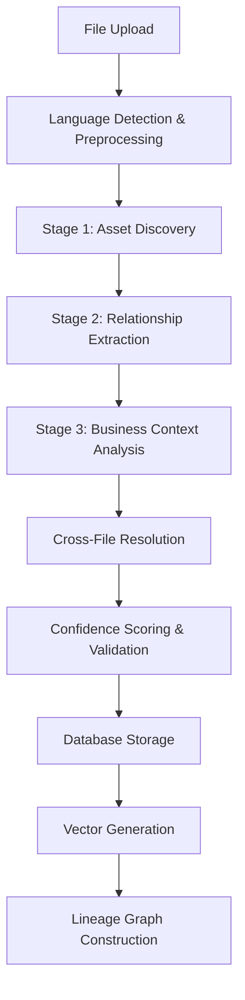

# Universal Data Lineage Implementation Roadmap

## Phase 2 Architecture Overview

### 🎯 **Objective**
Build a universal data lineage and dependency tracking system that works across 500+ files in SQL, Python, PySpark, Scala, and R without requiring dbt migration.

## 🏗️ **Architecture Components**

### 1. Enhanced Code Processor (Multi-Stage LLM Pipeline)



### 2. Database Architecture
- **Core Tables**: `data_assets`, `data_columns`, `code_functions`
- **Lineage Tables**: `data_lineage`, `column_lineage`, `function_dependencies`
- **Analysis Tables**: `impact_analysis`, `schema_changes`
- **Vector Storage**: Enhanced with lineage-specific metadata

### 3. Processing Strategy for Scale
- **Batch Processing**: Handle 500+ files in parallel batches
- **Incremental Updates**: Process only changed files
- **Cross-Reference Resolution**: Multi-pass processing for dependencies
- **Confidence-Based Storage**: Different treatment based on LLM confidence

## 📋 **Implementation Plan**

### **Sprint 1: Core Infrastructure (Week 1-2)**

#### Database Schema Setup
- ✅ **DONE**: Lineage schema migration (`20250627220000_create_lineage_schema.sql`)
- ✅ **DONE**: Enhanced vector metadata schema
- 🔄 **TODO**: Run migrations on development environment

#### Enhanced Code Processor Foundation
```typescript
// Update: duckcode-observability/supabase/functions/code-processor/index.ts

interface LineageProcessingJob {
  stage: 'asset_discovery' | 'relationship_mapping' | 'business_analysis' | 'cross_resolution';
  file_context: {
    file_id: string;
    file_path: string;
    language: string;
    content: string;
  };
  discovered_assets?: DataAsset[];
  lineage_relationships?: LineageRelationship[];
  confidence_score: number;
}
```

#### Multi-Stage Processing Pipeline
```typescript
async function processFileForLineage(fileData: FileContext): Promise<LineageResult> {
  // Stage 1: Asset Discovery
  const assets = await discoverDataAssets(fileData);
  
  // Stage 2: Relationship Mapping  
  const relationships = await extractLineageRelationships(fileData, assets);
  
  // Stage 3: Business Analysis
  const businessContext = await analyzeBusiness Context(fileData, relationships);
  
  // Store results with confidence scoring
  return await storeLineageResults({
    assets,
    relationships, 
    businessContext,
    confidence_score: calculateOverallConfidence([assets, relationships, businessContext])
  });
}
```

### **Sprint 2: LLM Prompt Engineering (Week 2-3)**

#### Language-Specific Analyzers
```typescript
// Stage 1: Asset Discovery Prompts
const SQL_ASSET_DISCOVERY_PROMPT = {
  system: `You are a data lineage expert analyzing SQL code...`,
  user_template: `Analyze this SQL file and extract all data assets:
    **File Path**: {file_path}
    **Code Content**: {code_content}
    Return JSON with assets, confidence_score, parsing_notes...`
};

const PYTHON_ASSET_DISCOVERY_PROMPT = {
  system: `You are analyzing Python/PySpark code for data lineage...`,
  user_template: `Analyze this Python file for data assets:
    **File Path**: {file_path}  
    **Code Content**: {code_content}
    Return JSON with assets, functions_defined, imports...`
};
```

#### Confidence Scoring System
```typescript
function calculateLineageConfidence(
  relationships: LineageRelationship[],
  language: string,
  codeContext: string
): number {
  const baseScore = 0.5;
  const languageBonus = getLanguageConfidenceBonus(language);
  const explicitBonus = hasExplicitRelationships(codeContext) ? 0.2 : 0;
  const contextBonus = codeContext.length > 100 ? 0.1 : 0;
  
  return Math.min(1.0, baseScore + languageBonus + explicitBonus + contextBonus);
}
```

### **Sprint 3: Parallel Processing Architecture (Week 3-4)**

#### Batch Processing System
```typescript
interface BatchProcessingConfig {
  batchSize: number; // 10-20 files per batch
  maxConcurrency: number; // 5 parallel batches
  retryAttempts: number; // 3 retries for failed files
  timeoutMs: number; // 300000 (5 minutes per file)
}

async function processBatchOfFiles(
  files: FileContext[],
  config: BatchProcessingConfig
): Promise<BatchResult> {
  const batches = chunkArray(files, config.batchSize);
  const results: LineageResult[] = [];
  
  for (const batch of batches) {
    const batchPromises = batch.map(file => 
      processFileForLineage(file).catch(error => ({
        file_id: file.id,
        error: error.message,
        success: false
      }))
    );
    
    const batchResults = await Promise.allSettled(batchPromises);
    results.push(...batchResults);
  }
  
  return { 
    processed: results.filter(r => r.success).length,
    failed: results.filter(r => !r.success).length,
    results 
  };
}
```

#### Progress Tracking & Status Updates
```typescript
// Enhanced job status tracking
interface LineageProcessingStatus {
  total_files: number;
  stage_progress: {
    asset_discovery: { completed: number; failed: number; };
    relationship_mapping: { completed: number; failed: number; };
    business_analysis: { completed: number; failed: number; };
    cross_resolution: { completed: number; failed: number; };
    vector_generation: { completed: number; failed: number; };
  };
  estimated_completion: string;
  current_batch: number;
  total_batches: number;
}
```

### **Sprint 4: Cross-File Resolution (Week 4-5)**

#### Dependency Resolution Engine
```typescript
async function resolveXXXFileReferences(
  allAssets: DataAsset[],
  allRelationships: LineageRelationship[]
): Promise<ResolvedLineage> {
  // 1. Build asset registry by name
  const assetRegistry = new Map<string, DataAsset>();
  
  // 2. Resolve table references across files
  const resolvedRelationships = await resolveTableReferences(
    allRelationships, 
    assetRegistry
  );
  
  // 3. Detect circular dependencies
  const circularDeps = detectCircularDependencies(resolvedRelationships);
  
  // 4. Calculate dependency depths
  const dependencyGraph = buildDependencyGraph(resolvedRelationships);
  
  return {
    resolved_relationships: resolvedRelationships,
    circular_dependencies: circularDeps,
    dependency_graph: dependencyGraph,
    orphaned_references: findOrphanedReferences(allRelationships, assetRegistry)
  };
}
```

### **Sprint 5: API Layer & Search (Week 5-6)**

#### Lineage Query APIs
```typescript
// GET /api/lineage/upstream/{assetId}?depth=3
export async function getUpstreamLineage(
  assetId: string, 
  depth: number = 3
): Promise<LineageGraph> {
  const query = `
    WITH RECURSIVE upstream_lineage AS (
      SELECT source_asset_id, target_asset_id, relationship_type, 0 as depth
      FROM code_insights.data_lineage 
      WHERE target_asset_id = $1
      
      UNION ALL
      
      SELECT dl.source_asset_id, dl.target_asset_id, dl.relationship_type, ul.depth + 1
      FROM code_insights.data_lineage dl
      JOIN upstream_lineage ul ON dl.target_asset_id = ul.source_asset_id
      WHERE ul.depth < $2
    )
    SELECT * FROM upstream_lineage;
  `;
  
  return await supabase.rpc('execute_lineage_query', { query, params: [assetId, depth] });
}

// POST /api/impact/analyze
export async function analyzeChangeImpact(changes: ChangeRequest[]): Promise<ImpactAnalysis> {
  for (const change of changes) {
    const downstreamAssets = await getDownstreamLineage(change.asset_id, 10);
    const impact = await assessBusinessImpact(change, downstreamAssets);
    await storeImpactAnalysis(impact);
  }
}
```

#### Enhanced Vector Search
```typescript
async function searchLineageByContext(
  query: string,
  filters: {
    data_domain?: string;
    business_criticality?: string;
    relationship_type?: string;
  }
): Promise<LineageSearchResult[]> {
  const embedding = await generateEmbedding(query);
  
  const searchQuery = `
    SELECT 
      lv.content,
      lv.metadata,
      dl.transformation_logic,
      dl.business_context,
      da_source.full_qualified_name as source_asset,
      da_target.full_qualified_name as target_asset,
      (lv.embedding <=> $1::vector) as similarity
    FROM code_insights.lineage_vectors lv
    JOIN code_insights.data_lineage dl ON lv.lineage_id = dl.id
    JOIN code_insights.data_assets da_source ON dl.source_asset_id = da_source.id
    JOIN code_insights.data_assets da_target ON dl.target_asset_id = da_target.id
    WHERE ($2::text IS NULL OR lv.metadata->>'data_domain' = $2)
    AND ($3::text IS NULL OR lv.metadata->>'business_criticality' = $3)
    ORDER BY similarity ASC
    LIMIT 20;
  `;
  
  return await supabase.rpc('vector_search_lineage', {
    query_embedding: embedding,
    data_domain: filters.data_domain,
    business_criticality: filters.business_criticality
  });
}
```

### **Sprint 6: UI Integration (Week 6-7)**

#### Lineage Visualization Components
```typescript
// New component: LineageGraphViewer.tsx
interface LineageNode {
  id: string;
  name: string;
  type: 'table' | 'view' | 'function';
  criticality: 'low' | 'medium' | 'high' | 'critical';
  metadata: any;
}

interface LineageEdge {
  source: string;
  target: string;
  relationship: string;
  confidence: number;
  transformationLogic?: string;
}

const LineageGraphViewer: React.FC<{
  assetId: string;
  direction: 'upstream' | 'downstream' | 'both';
  depth: number;
}> = ({ assetId, direction, depth }) => {
  // Use D3.js or React Flow for interactive graph visualization
  // Show confidence scores, transformation logic on hover
  // Allow drilling down into column-level lineage
};
```

#### Impact Analysis Dashboard
```typescript
// New component: ImpactAnalysisDashboard.tsx
const ImpactAnalysisDashboard: React.FC = () => {
  return (
    <div className="grid grid-cols-1 lg:grid-cols-2 gap-6">
      <ImpactSummaryCard />
      <BusinessCriticalityMatrix />
      <ChangeRiskAssessment />
      <StakeholderNotifications />
    </div>
  );
};
```

## 🚀 **Implementation Strategy**

### **Parallel Development Approach**
1. **Backend Team**: Focus on LLM processing pipeline and database operations
2. **Frontend Team**: Build lineage visualization and impact analysis UI
3. **DevOps Team**: Set up processing infrastructure and monitoring

### **Testing Strategy**
1. **Unit Tests**: Test each LLM processing stage independently
2. **Integration Tests**: Test cross-file resolution and dependency detection
3. **Performance Tests**: Validate 500+ file processing capability
4. **Accuracy Tests**: Manual validation of lineage extraction accuracy

### **Rollout Plan**
1. **Phase 1**: Deploy with 50 files for validation
2. **Phase 2**: Scale to 200 files with monitoring
3. **Phase 3**: Full 500+ file deployment
4. **Phase 4**: Cross-repository lineage tracking

## 📊 **Success Metrics**

### **Technical Metrics**
- **Processing Speed**: < 2 minutes per file average
- **Accuracy**: > 85% lineage relationship accuracy
- **Coverage**: > 90% of data assets discovered
- **Performance**: Handle 500+ files in < 4 hours

### **Business Metrics**
- **Impact Analysis**: Identify 100% of critical downstream dependencies
- **Change Management**: Reduce schema change incidents by 70%
- **Documentation**: Auto-generate lineage docs for 95% of data assets
- **Compliance**: Track data lineage for regulatory requirements

## 🔧 **Technical Considerations**

### **LLM Cost Optimization**
- **Caching**: Cache LLM responses for similar code patterns
- **Chunking**: Process large files in optimized chunks
- **Model Selection**: Use cost-effective models for simpler tasks

### **Error Handling & Recovery**
- **Graceful Degradation**: Continue processing other files if one fails
- **Retry Logic**: Implement exponential backoff for temporary failures
- **Manual Override**: Allow manual validation of low-confidence results

### **Monitoring & Observability**
- **Processing Metrics**: Track success rates, processing times, confidence scores
- **Quality Metrics**: Monitor lineage accuracy through spot checks
- **Business Metrics**: Track usage patterns and search queries

This comprehensive implementation plan provides a structured approach to building a production-ready universal data lineage system that can handle enterprise-scale codebases across multiple programming languages. 