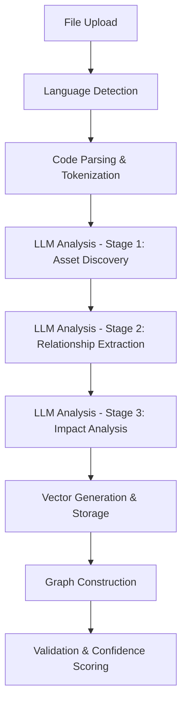

# Universal Data Lineage & Dependency Architecture

## Core Database Schema Design

### 1. Core Entity Tables

```sql
-- Data Assets Registry (Tables, Views, Functions, etc.)
CREATE TABLE code_insights.data_assets (
    id UUID PRIMARY KEY DEFAULT gen_random_uuid(),
    asset_name TEXT NOT NULL,
    asset_type TEXT NOT NULL, -- 'table', 'view', 'function', 'procedure', 'dataset', 'model'
    schema_name TEXT,
    database_name TEXT,
    full_qualified_name TEXT GENERATED ALWAYS AS (
        COALESCE(database_name || '.', '') || 
        COALESCE(schema_name || '.', '') || 
        asset_name
    ) STORED,
    asset_metadata JSONB, -- Column definitions, data types, constraints
    description TEXT,
    tags TEXT[],
    created_at TIMESTAMPTZ DEFAULT NOW(),
    updated_at TIMESTAMPTZ DEFAULT NOW(),
    discovered_by_file_id UUID REFERENCES code_insights.files(id),
    
    UNIQUE(full_qualified_name)
);

-- Columns Registry (with detailed metadata)
CREATE TABLE code_insights.data_columns (
    id UUID PRIMARY KEY DEFAULT gen_random_uuid(),
    asset_id UUID NOT NULL REFERENCES code_insights.data_assets(id) ON DELETE CASCADE,
    column_name TEXT NOT NULL,
    column_type TEXT, -- 'VARCHAR(255)', 'INTEGER', 'TIMESTAMP', etc.
    is_nullable BOOLEAN DEFAULT TRUE,
    is_primary_key BOOLEAN DEFAULT FALSE,
    is_foreign_key BOOLEAN DEFAULT FALSE,
    default_value TEXT,
    column_description TEXT,
    column_metadata JSONB, -- Constraints, indexes, etc.
    ordinal_position INTEGER,
    created_at TIMESTAMPTZ DEFAULT NOW(),
    updated_at TIMESTAMPTZ DEFAULT NOW(),
    
    UNIQUE(asset_id, column_name)
);

-- Functions/Procedures Registry  
CREATE TABLE code_insights.code_functions (
    id UUID PRIMARY KEY DEFAULT gen_random_uuid(),
    function_name TEXT NOT NULL,
    function_type TEXT NOT NULL, -- 'function', 'procedure', 'macro', 'udf', 'method'
    language TEXT NOT NULL, -- 'sql', 'python', 'scala', 'r'
    signature TEXT, -- Full function signature with parameters
    return_type TEXT,
    function_body TEXT, -- The actual code if available
    parameters JSONB, -- Array of parameter definitions
    description TEXT,
    namespace TEXT, -- Package/module/schema context
    file_id UUID REFERENCES code_insights.files(id),
    line_start INTEGER,
    line_end INTEGER,
    created_at TIMESTAMPTZ DEFAULT NOW(),
    updated_at TIMESTAMPTZ DEFAULT NOW()
);
```

### 2. Relationship & Lineage Tables

```sql
-- Data Lineage Relationships (Table-to-Table)
CREATE TABLE code_insights.data_lineage (
    id UUID PRIMARY KEY DEFAULT gen_random_uuid(),
    source_asset_id UUID NOT NULL REFERENCES code_insights.data_assets(id),
    target_asset_id UUID NOT NULL REFERENCES code_insights.data_assets(id),
    relationship_type TEXT NOT NULL, -- 'reads_from', 'writes_to', 'transforms', 'aggregates', 'joins'
    operation_type TEXT, -- 'select', 'insert', 'update', 'delete', 'merge', 'create_table_as'
    confidence_score REAL DEFAULT 0.8, -- LLM confidence in this relationship
    
    -- Context about the relationship
    transformation_logic TEXT, -- Description of how data flows
    business_context TEXT, -- Why this relationship exists
    discovered_in_file_id UUID REFERENCES code_insights.files(id),
    discovered_at_line INTEGER,
    
    -- Metadata for complex relationships
    join_conditions JSONB, -- For join relationships
    filter_conditions JSONB, -- WHERE clauses, etc.
    aggregation_logic JSONB, -- GROUP BY, window functions
    
    created_at TIMESTAMPTZ DEFAULT NOW(),
    updated_at TIMESTAMPTZ DEFAULT NOW(),
    
    UNIQUE(source_asset_id, target_asset_id, relationship_type, discovered_in_file_id)
);

-- Column-Level Lineage (Column-to-Column)
CREATE TABLE code_insights.column_lineage (
    id UUID PRIMARY KEY DEFAULT gen_random_uuid(),
    source_column_id UUID NOT NULL REFERENCES code_insights.data_columns(id),
    target_column_id UUID NOT NULL REFERENCES code_insights.data_columns(id),
    transformation_type TEXT NOT NULL, -- 'direct', 'calculated', 'aggregated', 'concatenated', 'cast'
    transformation_logic TEXT, -- SQL expression or Python code
    confidence_score REAL DEFAULT 0.8,
    
    -- Lineage context
    discovered_in_file_id UUID REFERENCES code_insights.files(id),
    discovered_at_line INTEGER,
    business_rule TEXT, -- Business meaning of transformation
    
    -- Complex transformation metadata
    calculation_formula TEXT, -- For calculated fields
    aggregation_function TEXT, -- SUM, COUNT, AVG, etc.
    grouping_columns JSONB, -- Array of column IDs used for grouping
    
    created_at TIMESTAMPTZ DEFAULT NOW(),
    updated_at TIMESTAMPTZ DEFAULT NOW()
);

-- Function Dependencies (Function calls, imports, etc.)
CREATE TABLE code_insights.function_dependencies (
    id UUID PRIMARY KEY DEFAULT gen_random_uuid(),
    caller_function_id UUID REFERENCES code_insights.code_functions(id),
    called_function_id UUID REFERENCES code_insights.code_functions(id),
    dependency_type TEXT NOT NULL, -- 'calls', 'imports', 'inherits', 'overrides'
    call_context TEXT, -- Parameters passed, return value used
    call_frequency INTEGER DEFAULT 1, -- How many times called in the file
    discovered_in_file_id UUID REFERENCES code_insights.files(id),
    discovered_at_line INTEGER,
    created_at TIMESTAMPTZ DEFAULT NOW()
);

-- Cross-File Dependencies
CREATE TABLE code_insights.file_dependencies (
    id UUID PRIMARY KEY DEFAULT gen_random_uuid(),
    source_file_id UUID NOT NULL REFERENCES code_insights.files(id),
    target_file_id UUID NOT NULL REFERENCES code_insights.files(id),
    dependency_type TEXT NOT NULL, -- 'imports', 'includes', 'references', 'executes'
    import_statement TEXT, -- The actual import/include statement
    confidence_score REAL DEFAULT 0.8,
    discovered_at TIMESTAMPTZ DEFAULT NOW()
);
```

### 3. Impact Analysis & Change Tracking

```sql
-- Change Impact Analysis
CREATE TABLE code_insights.impact_analysis (
    id UUID PRIMARY KEY DEFAULT gen_random_uuid(),
    changed_asset_id UUID NOT NULL REFERENCES code_insights.data_assets(id),
    impacted_asset_id UUID NOT NULL REFERENCES code_insights.data_assets(id),
    impact_type TEXT NOT NULL, -- 'breaking', 'warning', 'info'
    impact_description TEXT,
    propagation_depth INTEGER, -- How many hops away
    estimated_severity TEXT, -- 'high', 'medium', 'low'
    business_impact TEXT,
    created_at TIMESTAMPTZ DEFAULT NOW()
);

-- Schema Evolution Tracking
CREATE TABLE code_insights.schema_changes (
    id UUID PRIMARY KEY DEFAULT gen_random_uuid(),
    asset_id UUID NOT NULL REFERENCES code_insights.data_assets(id),
    change_type TEXT NOT NULL, -- 'column_added', 'column_removed', 'type_changed', 'table_created', 'table_dropped'
    old_definition JSONB,
    new_definition JSONB,
    change_description TEXT,
    breaking_change BOOLEAN DEFAULT FALSE,
    discovered_in_file_id UUID REFERENCES code_insights.files(id),
    discovered_at TIMESTAMPTZ DEFAULT NOW()
);
```

## 4. Enhanced Vector Storage for Dependency Context

```sql
-- Extend existing document_vectors for dependency-aware search
ALTER TABLE code_insights.document_vectors 
ADD COLUMN dependency_type TEXT, -- 'source', 'target', 'transformer', 'aggregator'
ADD COLUMN lineage_depth INTEGER DEFAULT 0, -- How deep in dependency chain
ADD COLUMN business_criticality TEXT DEFAULT 'medium', -- 'critical', 'high', 'medium', 'low'
ADD COLUMN data_domain TEXT; -- 'customer', 'finance', 'product', 'operations'

-- Lineage-specific vector chunks
CREATE TABLE code_insights.lineage_vectors (
    id UUID PRIMARY KEY DEFAULT gen_random_uuid(),
    lineage_id UUID REFERENCES code_insights.data_lineage(id),
    vector_type TEXT NOT NULL, -- 'transformation_logic', 'business_context', 'impact_analysis'
    content TEXT NOT NULL,
    metadata JSONB,
    embedding VECTOR(1536), -- OpenAI embedding
    created_at TIMESTAMPTZ DEFAULT NOW()
);
```

## Processing Architecture

### 1. Multi-Stage LLM Analysis Pipeline



### 2. LLM Prompt Engineering Strategy

#### Stage 1: Asset Discovery
```json
{
  "system_prompt": "Extract all data assets from this code file...",
  "expected_output": {
    "tables": [{"name": "users", "type": "source_table", "columns": [...]}],
    "functions": [{"name": "calculate_metrics", "type": "transformation"}],
    "imports": [{"module": "pandas", "alias": "pd"}]
  }
}
```

#### Stage 2: Relationship Extraction  
```json
{
  "system_prompt": "Analyze data flow and dependencies...",
  "expected_output": {
    "table_relationships": [
      {
        "source": "raw_users",
        "target": "clean_users", 
        "type": "transforms",
        "transformation": "Data cleaning and validation"
      }
    ],
    "column_lineage": [...]
  }
}
```

### 3. Confidence Scoring & Validation

```sql
-- Function to calculate relationship confidence
CREATE OR REPLACE FUNCTION calculate_lineage_confidence(
    relationship_data JSONB,
    code_context TEXT,
    file_language TEXT
) RETURNS REAL AS $$
BEGIN
    -- Implement confidence scoring logic
    -- Based on: code clarity, naming conventions, explicit relationships
    RETURN confidence_score;
END;
$$ LANGUAGE plpgsql;
```

## API Design for Lineage Queries

### 1. Lineage Discovery APIs

```typescript
// Get upstream dependencies (what feeds into this table)
GET /api/lineage/upstream/{assetId}?depth=3

// Get downstream impact (what depends on this table)  
GET /api/lineage/downstream/{assetId}?depth=5

// Column-level lineage
GET /api/lineage/column/{columnId}/trace

// Cross-repository lineage
GET /api/lineage/cross-repo/{repoName}/{assetName}
```

### 2. Impact Analysis APIs

```typescript
// Analyze impact of proposed changes
POST /api/impact/analyze
{
  "changes": [
    {"type": "drop_column", "asset": "users", "column": "email"},
    {"type": "rename_table", "from": "orders", "to": "customer_orders"}
  ]
}

// Get business impact summary
GET /api/impact/business/{assetId}
```

## Performance Considerations

### 1. Indexing Strategy
```sql
-- Core performance indexes
CREATE INDEX idx_lineage_source_target ON data_lineage(source_asset_id, target_asset_id);
CREATE INDEX idx_lineage_discovery ON data_lineage(discovered_in_file_id);
CREATE INDEX idx_assets_qualified_name ON data_assets USING gin(full_qualified_name gin_trgm_ops);
CREATE INDEX idx_columns_asset_lineage ON column_lineage(source_column_id, target_column_id);

-- Vector similarity indexes
CREATE INDEX idx_lineage_vectors_embedding ON lineage_vectors USING ivfflat (embedding vector_cosine_ops);
```

### 2. Caching & Materialized Views
```sql
-- Materialized view for common lineage queries
CREATE MATERIALIZED VIEW lineage_graph_summary AS
SELECT 
    da.full_qualified_name as asset_name,
    COUNT(dl_upstream.id) as upstream_count,
    COUNT(dl_downstream.id) as downstream_count,
    MAX(dl_upstream.confidence_score) as max_upstream_confidence,
    ARRAY_AGG(DISTINCT da_upstream.full_qualified_name) as upstream_assets
FROM data_assets da
LEFT JOIN data_lineage dl_upstream ON da.id = dl_upstream.target_asset_id  
LEFT JOIN data_lineage dl_downstream ON da.id = dl_downstream.source_asset_id
LEFT JOIN data_assets da_upstream ON dl_upstream.source_asset_id = da_upstream.id
GROUP BY da.id, da.full_qualified_name;
```

This architecture provides:
- **Scalability**: Handle 500+ files efficiently
- **Language Agnostic**: Works with any programming language  
- **Deep Analysis**: Table → Column → Function level tracking
- **Business Context**: Impact analysis and change management
- **AI-Powered**: LLM-driven dependency discovery
- **Performance**: Optimized for complex lineage queries 