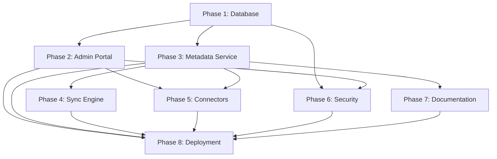

# Enterprise Migration - Implementation Roadmap

## 📅 Timeline Overview

**Total Duration**: 16-20 weeks (4-5 months)

```
Phase 1: Database Schema (Weeks 1-3)
Phase 2: Admin Portal (Weeks 4-7)
Phase 3: Metadata Service (Weeks 8-11)
Phase 4: Sync Engine (Weeks 12-14)
Phase 5: Connectors (Weeks 15-17)
Phase 6: Security & RBAC (Weeks 18-19)
Phase 7: Documentation (Weeks 20-21)
Phase 8: Deployment (Weeks 22-24)
```

## 🎯 Quick Start Guide

### For Team Lead
1. Review all phase plans in numbered folders
2. Assign team members to each phase
3. Set up project tracking (Jira, Linear, etc.)
4. Schedule weekly check-ins
5. Start with Phase 1 database schema

### For Developers
1. Read `README.md` for overview
2. Review your assigned phase folder
3. Read `PLAN.md` for technical approach
4. Check `TASKS.md` for actionable items
5. Start implementation

### For Stakeholders
1. Review timeline and milestones
2. Understand feature rollout plan
3. Provide feedback on priorities
4. Approve budget and resources
5. Plan customer communication

## 📊 Phase Dependencies



**Key Insights**:
- Phase 1 (Database) is the foundation - must complete first
- Phases 2-5 can partially overlap once Phase 1 is done
- Phase 6 (Security) should be continuous throughout
- Phase 8 (Deployment) requires all previous phases complete

## 🏗️ Resource Requirements

### Team Composition
- **Backend Engineers**: 2-3 developers
  - Focus: Metadata service, sync engine, connectors
  - Skills: Node.js/TypeScript, PostgreSQL, Python (for SQLglot)

- **Frontend Engineers**: 2 developers
  - Focus: Admin portal UI, IDE extension updates
  - Skills: React, TypeScript, VS Code extension development

- **Database Engineer**: 1 developer
  - Focus: Schema design, RLS policies, migrations
  - Skills: PostgreSQL, Supabase, database optimization

- **DevOps Engineer**: 1 developer
  - Focus: Deployment, CI/CD, monitoring
  - Skills: Docker, Kubernetes/Cloud platforms, monitoring tools

- **QA Engineer**: 1 tester
  - Focus: Testing all phases, migration validation
  - Skills: Integration testing, security testing, load testing

### Infrastructure
- Supabase Production instance (or self-hosted PostgreSQL)
- Backend hosting (Vercel, AWS, GCP, or Azure)
- Frontend hosting (Vercel, Netlify, or Cloudflare Pages)
- CI/CD pipeline (GitHub Actions)
- Monitoring (Datadog, New Relic, or similar)
- Error tracking (Sentry)

## 🎯 Milestones & Deliverables

### Milestone 1: Foundation Complete (Week 3)
**Deliverables**:
- ✅ Enterprise schema deployed to Supabase
- ✅ All tables created with RLS policies
- ✅ Helper functions working
- ✅ Migration scripts tested

### Milestone 2: Admin Portal Live (Week 7)
**Deliverables**:
- ✅ Admin portal deployed
- ✅ Team management working
- ✅ User invitations functional
- ✅ Basic settings available

### Milestone 3: Metadata in Cloud (Week 11)
**Deliverables**:
- ✅ Metadata extraction service deployed
- ✅ GitHub connector extracting to cloud
- ✅ Metadata stored in Supabase
- ✅ SQLglot parser working server-side

### Milestone 4: Sync Working (Week 14)
**Deliverables**:
- ✅ Sync service deployed
- ✅ Initial sync downloads metadata
- ✅ Incremental sync works
- ✅ IDE updates automatically

### Milestone 5: Connectors Ready (Week 17)
**Deliverables**:
- ✅ Connector framework implemented
- ✅ 5+ data source connectors working
- ✅ Connector config UI in admin portal
- ✅ Scheduled extraction working

### Milestone 6: Security Certified (Week 19)
**Deliverables**:
- ✅ RBAC fully implemented
- ✅ Audit logging active
- ✅ API keys encrypted
- ✅ Security audit passed

### Milestone 7: Documentation Complete (Week 21)
**Deliverables**:
- ✅ AI documentation generation working
- ✅ Quality scoring implemented
- ✅ Auto-suggestions provided
- ✅ Documentation UI live

### Milestone 8: Production Launch (Week 24)
**Deliverables**:
- ✅ All features deployed to production
- ✅ Users migrated successfully
- ✅ Zero critical bugs
- ✅ Performance targets met

## 🔄 Agile Workflow

### Sprint Structure (2-week sprints)
**Sprint Planning**:
- Review phase tasks
- Assign story points
- Set sprint goals
- Define acceptance criteria

**Daily Standups**:
- What did I complete yesterday?
- What am I working on today?
- Any blockers?

**Sprint Review**:
- Demo completed features
- Gather stakeholder feedback
- Update roadmap if needed

**Sprint Retrospective**:
- What went well?
- What can be improved?
- Action items for next sprint

## 📈 Success Metrics

### Technical Metrics
- **Code Coverage**: >80% for new code
- **API Response Time**: <200ms p95
- **Database Query Time**: <100ms p95
- **Sync Speed**: 1000 objects/second
- **Uptime**: 99.9% SLA

### Business Metrics
- **User Adoption**: 90% of users in organizations within 1 month
- **Connector Usage**: Average 3 connectors per organization
- **Metadata Coverage**: 80% of tables documented
- **Customer Satisfaction**: NPS >50

## 🚨 Risk Management

### High-Risk Items
1. **SQLglot Python Integration**
   - Risk: Complex to integrate with Node.js backend
   - Mitigation: Build Python microservice or use child processes
   - Contingency: Use simpler regex-based parsing

2. **Data Migration**
   - Risk: User data loss during migration
   - Mitigation: Comprehensive testing, backups, rollback plan
   - Contingency: Manual data recovery procedures

3. **Performance at Scale**
   - Risk: Slow queries with 100k+ objects
   - Mitigation: Proper indexing, query optimization, caching
   - Contingency: Database scaling, query rewrites

4. **User Adoption**
   - Risk: Users resistant to enterprise features
   - Mitigation: Clear communication, training, gradual rollout
   - Contingency: Keep individual mode as fallback

## 💰 Budget Estimate

### Infrastructure (Monthly)
- Supabase Pro: $25-250/month
- Backend hosting: $50-200/month
- Frontend hosting: $20-50/month
- Monitoring tools: $50-100/month
- **Total**: ~$150-600/month

### Development (One-time)
- 6 developers × 4 months × $10k/month = $240k
- QA/Testing: $20k
- Infrastructure setup: $10k
- **Total**: ~$270k

### Ongoing (Annual)
- Maintenance: $50k/year
- Support: $30k/year
- Infrastructure: $2k-7k/year
- **Total**: ~$82k-87k/year

## 📞 Support & Communication

### Channels
- **Slack**: #duckcode-enterprise for team chat
- **GitHub**: Issues and PRs
- **Notion/Confluence**: Documentation
- **Jira/Linear**: Task tracking
- **Zoom**: Weekly sync meetings

### Meeting Schedule
- **Daily Standup**: 15 minutes, 9:30 AM
- **Sprint Planning**: 2 hours, every other Monday
- **Sprint Review**: 1 hour, every other Friday
- **Retrospective**: 1 hour, every other Friday
- **Architecture Review**: 1 hour, weekly Wednesday

## 🎓 Training Plan

### For Admin Users
- Week 1: Admin portal training (2 hours)
- Week 2: Team management training (1 hour)
- Week 3: Connector setup training (2 hours)

### For End Users
- Week 1: IDE extension updates (30 minutes)
- Week 2: Metadata browsing (1 hour)
- Week 3: Best practices (1 hour)

### For Developers
- Week 1: Architecture overview (2 hours)
- Week 2: API documentation (2 hours)
- Week 3: Contributing guide (1 hour)

## 🎉 Launch Plan

### Pre-Launch (2 weeks before)
- Announce launch date
- Offer early access to select customers
- Gather feedback and fix bugs
- Finalize documentation

### Launch Day
- Deploy to production
- Send launch email
- Monitor closely
- Quick response team on standby

### Post-Launch (1 month)
- Gather user feedback
- Fix bugs quickly
- Optimize performance
- Plan next features

---

**Last Updated**: January 15, 2025
**Version**: 1.0
**Status**: Planning Complete ✅
